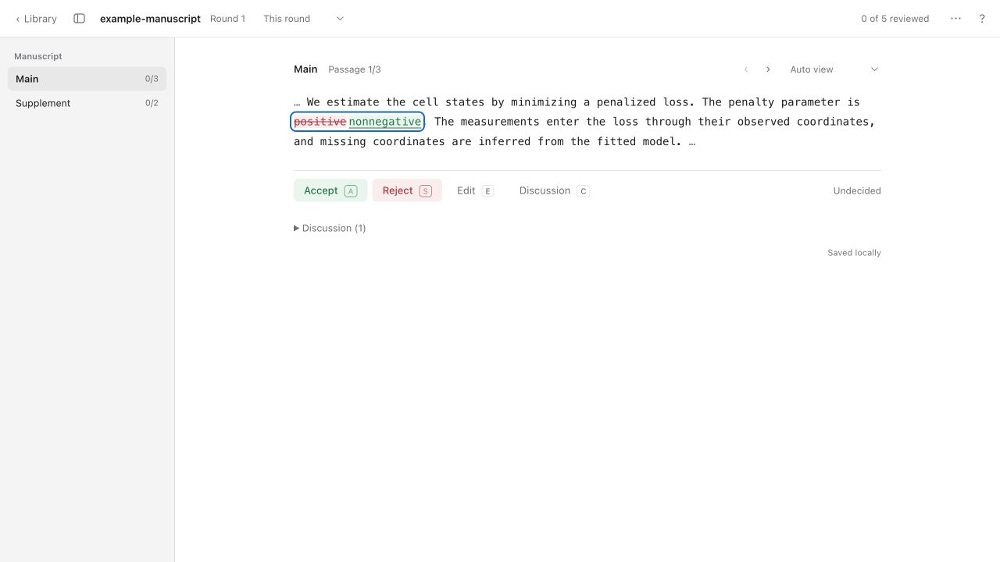
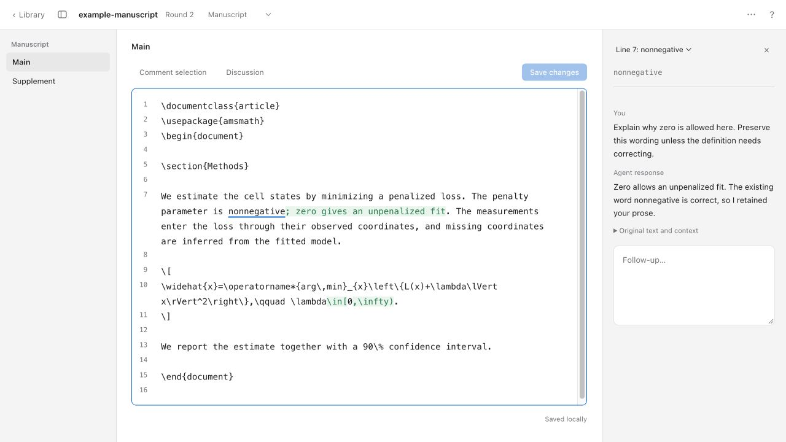

# Manuscript Review

Read and annotate a manuscript, or review revisions one word change at a time, with highlighted LaTeX previews, full-file editing, and comments that stay with each round.

The app is designed for authors reviewing substantial edits from students, collaborators, or agents. In comparisons, text opens as a short excerpt with the exact additions and deletions highlighted. Equations and algorithms open side by side as typeset LaTeX. Reviews stay on your computer; an agent can read your saved feedback and prepare another round through the bundled skill.

## Install

Download the [macOS app](https://github.com/njwfish/manuscript-review/releases/latest), unzip it, and move **Manuscript Review.app** to **Applications**. The app supports Apple Silicon Macs on macOS 13 or later and includes Python. Git is required; LaTeX and Poppler are optional for typeset previews.

See [Installation](docs/INSTALL.md) for prerequisites, first launch, the agent skill, and running from source on macOS or Linux.

## Review a manuscript

Start with manuscript text sources in a Git repository with at least one commit; [prepare a plain manuscript folder](docs/INSTALL.md#prepare-a-manuscript-folder) if needed. **Open manuscript** opens the whole selected manuscript for reading, editing, and comments, even when there are no changes to compare. Reopening the same repository resumes its latest saved review, including choices and drafts. To bring in subsequent changes made outside the app, use **New round** or **Compare versions**.

To review an existing diff, choose **Compare versions**, then a **Local folder** or **GitHub repository**. A local folder can contain a nested manuscript repository; choose one if several are found. For GitHub, paste its URL and choose a parent folder to clone into. Existing Git credentials handle private repositories.

Pick **Compare from** and **Compare to** from dropdowns of saved review checkpoints, branches, tags, and recent commits. Each commit shows its date, message, and short hash; use **Find a version** to filter them. **Working files** captures tracked files, including staged new files, without changing HEAD or the index. **Fetch latest commits** updates remote history without merging or changing your manuscript. Choose the LaTeX entry file for equation and algorithm previews.

The Library shows one entry per manuscript, with its latest review and earlier rounds under **History**. **Open** resumes the current round. **New round** compares working files against the latest selected draft and preserves the original baseline. Earlier choices are already part of the starting draft, so rejecting a new edit keeps that earlier wording. **Compare…** lets you choose another pair of versions.

The review opens in **This round**, showing only changes from its starting draft to its proposal. Switch to **Since baseline**, or press **T**, to inspect the selected manuscript against the original baseline. This cumulative view updates with your decisions; review decisions belong to **This round**. Earlier comments and replies remain available beside matching edits and in **All feedback**. The app reopens your last review on launch.

Use **Accept** or **A** to keep an edit, **Reject** or **S** to restore this round’s starting wording, and **Reset** or **U** to leave it undecided. Accepting or rejecting advances to the next edit; **D / F** moves backward or forward. Choices and comments save automatically. When the review is complete, **Apply review** writes the selected wording to your manuscript.

## Edit and discuss

Click proposed text, click a proposed LaTeX preview, or press **E** to edit the file at the current passage. The source editor replaces the passage display and shows the whole selected file in monospace, with change highlights. Scroll elsewhere to make additional changes; **⌘/Ctrl+F** finds text and standard undo/redo keys work throughout.

**Save changes**, **⌘/Ctrl+S**, or **⌘/Ctrl+Enter** writes your manual changes and refreshes the diff against this round’s starting draft. Your new changes are accepted. Unrelated decisions and working-file text stay as they were; **Apply review** writes the remaining selected wording. Comments on revised edits move into discussion, and saving refreshes equation previews. **Esc** returns to review and retains the file draft across app restarts; Manuscript view stays in the editor. The draft indicator or **Shift+E** resumes it; **Discard draft** clears it. Save or discard a file draft before changing decisions in that file.

**Manuscript** in the comparison selector shows all supported source files, including unchanged ones. Select text and choose **Comment selection**, or press **⌘/Ctrl+Shift+M**; without a selection, it comments on the current line. The marked text opens its discussion in the right sidebar. Comments save automatically, retain their original source context, and carry into later rounds. After an agent replies, the field creates a follow-up while preserving the exchange. **⌘/Ctrl+Shift+R** copies an agent request while the editor has focus.

Discussion appears in a collapsible right sidebar. Press **C** to comment on an edit, or **Shift+C** for a passage note; the selector changes the scope. Selecting a highlighted change in the editor brings its discussion alongside the source. Earlier feedback and replies appear above the comment field. **Q** searches all comments and responses. Replies append, so each revision pass retains the exchange.

When every edit has a decision, the completion area shows **Apply review** and **Copy agent request**. The header’s **Review complete** button returns to these actions after scrolling. **⌘/Ctrl+Enter** applies the review from the review view; **Applied** confirms the selected wording is written. Save or discard file drafts before applying. **Review tools → Apply review** can also apply a partial review, retaining proposed wording for undecided edits.

The macOS library lives in `~/Library/Application Support/Manuscript Review/`, separate from the app. Replacing the app preserves your saved reviews. [Advanced usage](docs/USAGE.md) covers exports, manual response imports, and recovery.

## Keyboard

| Key | Action |
| --- | --- |
| D / F | Previous / next edit |
| Shift+D / Shift+F | Previous / next passage |
| [ / ] | Previous / next file |
| A / S | Accept / reject and advance |
| Shift+A / Shift+S / Shift+U | Accept / reject / reset the passage |
| Ctrl+A / Ctrl+S / Ctrl+U | Accept / reject / reset the file |
| U | Reset the current decision |
| E | Edit the file at this passage |
| Shift+E | Resume a saved draft |
| C / Shift+C | Comment on edit / passage |
| Q | Search current comments and earlier replies |
| R | Copy an agent request for your chat |
| T | This round / Since baseline |
| ⌘/Ctrl+Enter | Save source / comment; apply a completed review |
| ⌘/Ctrl+S, ⌘/Ctrl+F | Save or find in the source editor |
| ⌘/Ctrl+Shift+M | Comment on selected text or the current line |
| ⌘/Ctrl+Shift+R | Copy an agent request from the source editor |
| Esc | Return to review; keep source draft |
| V | Switch word changes / rendered LaTeX |
| G | Next undecided edit |
| ? | All shortcuts |
| ⌘Shift+L / ⌘N | Library / compare versions in the native app |

Holding a key does not repeat decisions. Shortcuts pause while typing; Tab and Enter work on controls.

## Work with an agent

Use **Library → Setup** to check dependencies and install the [manuscript-review skill](skills/manuscript-review/SKILL.md) for Codex or Claude Code. The [installation guide](docs/INSTALL.md#install-the-agent-skill) also covers manual setup. The skill uses the same review operations as the app; an agent needs local filesystem and shell access to your manuscript and saved library.

The cycle is **review → apply → ask the agent → review the next round**. When you finish deciding, use **Apply review** to write the selected wording, then **Copy agent request** or **R** and paste the prompt into your agent's chat. The prompt identifies the exact review and tells the agent to read your decisions, comments, and earlier responses. You can also request responses while decisions are still in progress.

For a manuscript without a diff, read, comment, and save any manual edits, then copy the agent request. The same skill reads these source comments and prepares a reviewable revision. Existing prose is settled wording: a style guide alone does not authorize rewriting it.

Replies without source changes stay in the current round. Text revisions create a new round against the previously selected draft, preserving earlier choices and the original baseline. Open the new round from the Library; **Since baseline** shows the accumulated selected changes. Agent conversation takes place in your existing chat, while the app keeps comments and responses beside their source context.

For an initial referee report, ask the agent to propose surgical revisions and explain each related set of changes in a passage note. For a long report, the skill can maintain an optional feedback CSV beside the manuscript. Subsequent iterations use replies to your comments.

## Development

See [Development](docs/DEVELOPMENT.md) for tests, native builds, and releases, and [Architecture](ARCHITECTURE.md) for the record model and transaction boundaries. The service uses Python's standard library, with a small JavaScript interface and a Swift macOS wrapper.

## License

[MIT](LICENSE). Bundled Python and PyInstaller notices are included in the app. The source editor includes CodeMirror and its dependency licenses in the bundled JavaScript.
